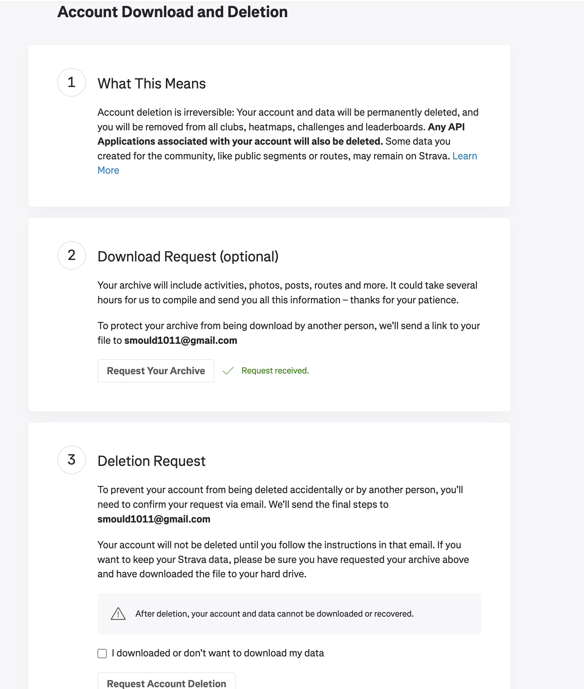
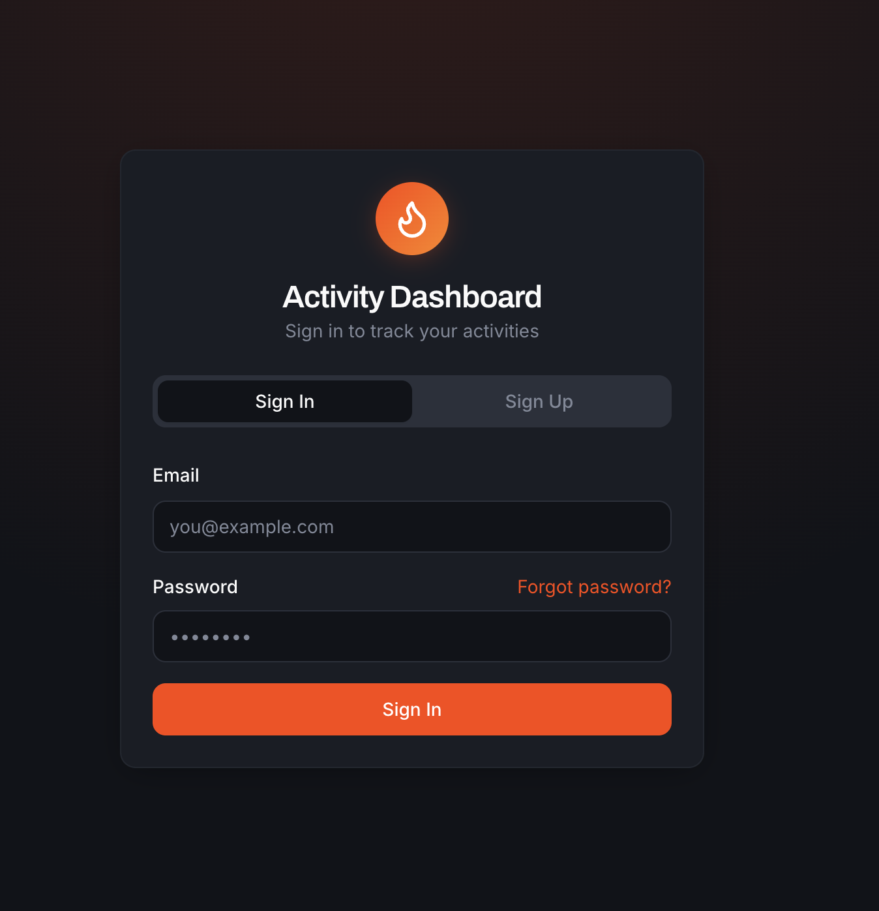
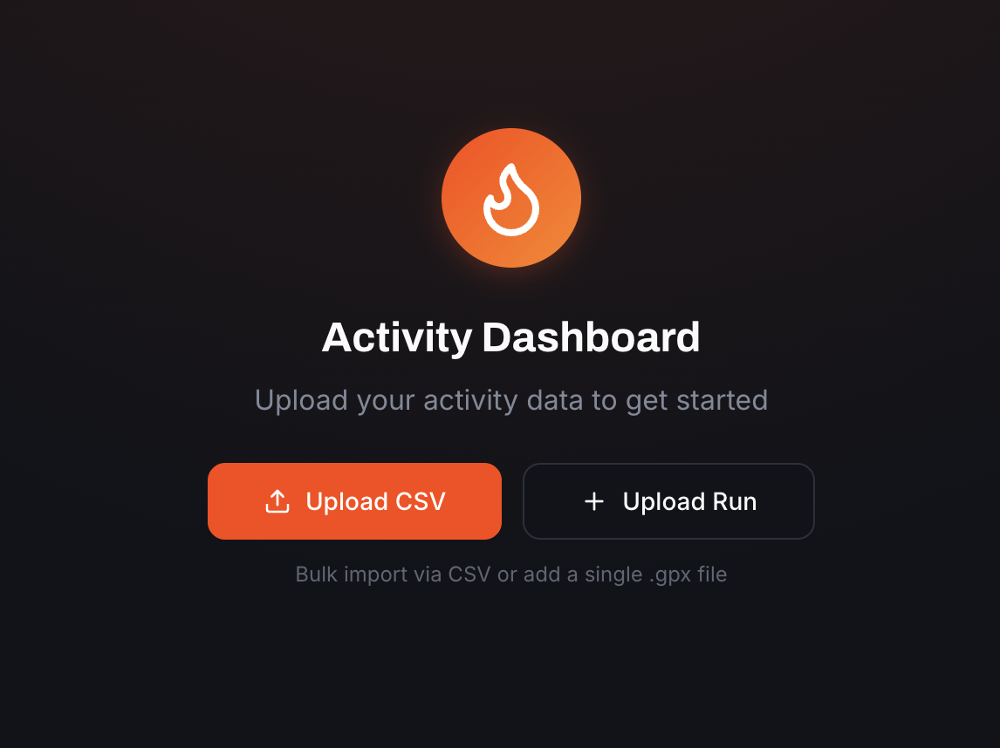

# Uploading Activities

## Download all your Strava data (5 minutes)

This takes only a couple of minutes to request the download, depending how much data you have on Strava it might take them longer to prepare your archive.

Strava:

* Login to Strava on the web and head to My Profile > Settings. This can be accessed from mousing over your profile picture.
* Download or Delete your account. Don't worry we're not going to go near deleting your account, you're going to click download.
* Download Request, **Request Your Archive**.

* You'll get an email once it's ready, with a download link
* Download and extract the. `.zip`, look for `archive.csv` , it's in the top level. Note: **not** within `activities` folder.

## Uploading to Weekly Mileage Tracker

### Account creation

At time of writing (Jan '26) sign-ups are invite only, the sign-up flow is disabled. Message me for an invite.

## Upload activities

For the first time its recommended to upload the `activities.csv` as a bulk upload. Later on, individual activities can be uploaded as .gpx files, which can be downloaded from Strava when viewing the individual activity.

Individual activities can be uploaded with the `Upload Run` button along the top navbar.
